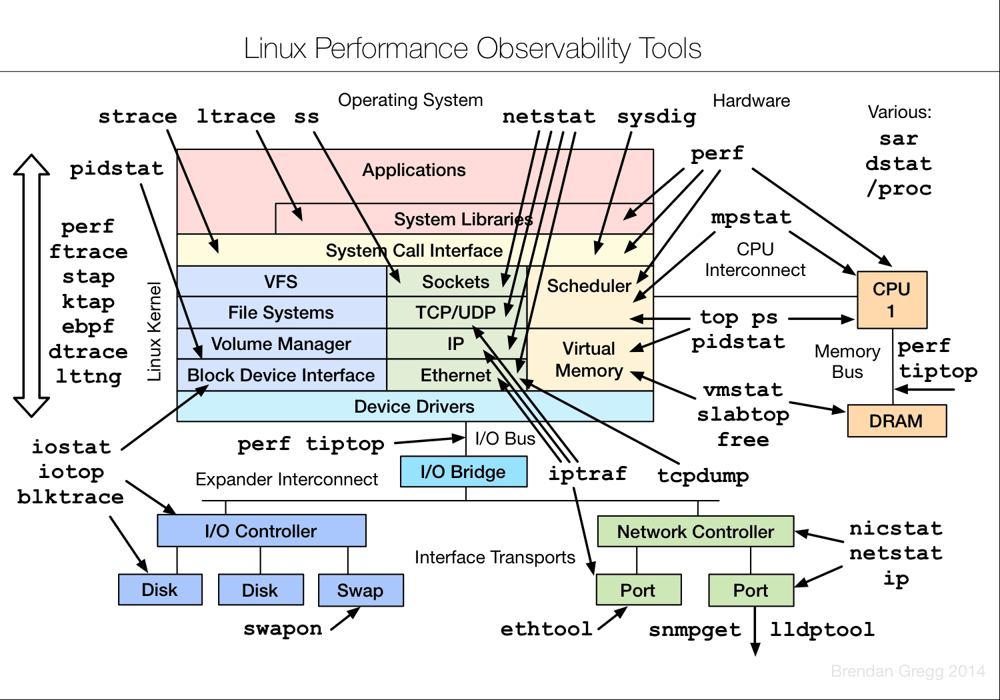

#1.linux各模块工具



#2.生成随机密钥：
```
cat /dev/urandom | base64 | head -n1 
```

#3.统计工程树下的所有 .cpp .h源码的非空行行数：
```
find . -name '*.cpp' | xargs cat | grep . | wc -l
find . -name '*.h' | xargs cat | grep . | wc -l
```

#4.杀死占用的端口进程 或者 遇到 Address already in use 
```
fuser -k 9999/tcp
```

#5.date
```
date -d @1456329600     #时间戳转字符串时间
Thu Feb 25 00:00:00 CST 2016
```

#6.top
```
在top中按M(按内存排序), P(按cpu占有率排序)
top -H -p 进程id #查看进程里的线程
```

#7.gstack
```
查看进程或线程的堆栈，方便定位cpu占有率高的问题
gstack 进程id
gstack 线程id
```

#8.tar
```
tar zxvf *.tar.gz
tar jxvf *.tar.bz2
```

#9.strace
```

```

#10.netstat
```

```

#11.nc
```

```

#12.curl
```

```

#13.ps
```

```

#14.cut
```

```

#15.split
```

```

#16.nl
```

```

#17.wc
```

```

#18.gerp
```
ps -ef | grep MyProc | grep -v 'grep'  #反向匹配
```

#19.sed
```

```

#20.xargs
```

```

#21.find
```

```

#22.ldd
```

```

#23.nm
```
nm a.out/a.so/a.a   #可以查看目标程序,动态库,静态库是否这个接口函数(cpp的程序/静态库/动态库加-C)

nm 命令使用以下符号（用同样的字符表示弱符号作为全局符号）之一来表示文件符号类型：
A    Global absolute 符号。
a    Local absolute 符号。
B    Global bss 符号。
b    Local bss 符号。
D    Global data 符号。
d    Local data 符号。
f    源文件名称符号。
T    Global text 符号。
t    Local text 符号。
U    未定义符号。

标志:
-C    限制解码（demangle） C++ 名称。缺省是解码所有 C++ 符号名。
C++ 对象文件中的符号在被使用前它们的名称已经被解码了。
-d    用十进制显示符号的值和大小。这是缺省的。
-e    只显示静态的和外部的（全局）符号。
-f    显示完整的输出，包括冗余的 .text、 .data 以及 .bss 符号，这些在通常都是被限制的。
-g    只显示外部的（全局）符号。
-h    限制输出头数据的显示。
-l    通过给 WEAK 符号的编码键附加一个 * 来区分 WEAK 和 GLOBAL 符号。
```

#24.readelf
```

```

#25.objcopy
```

```

#26.objdump
```

```

#27.ld
```

```

#28.perf
```
程序性能分析调优：https://perf.wiki.kernel.org/index.php/Main_Page
perf生成火焰图: http://www.brendangregg.com/FlameGraphs/cpuflamegraphs.html

```

#29.systemtap
```

```

#30.flex/lex
```
词法解析
```

#31.bison/yacc
```
语法解析
```


